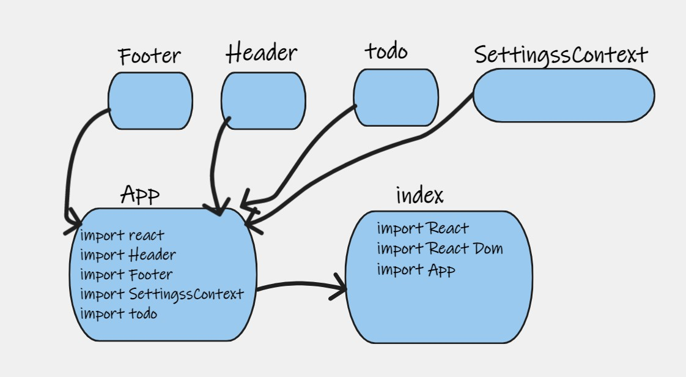

# Todo App

- In Phase 1, we’re going to perform some refactoring of the To Do application as built by another team. This application mixes application state and user settings at the top level and passes things around

- URL

- [PR context-settings ]().